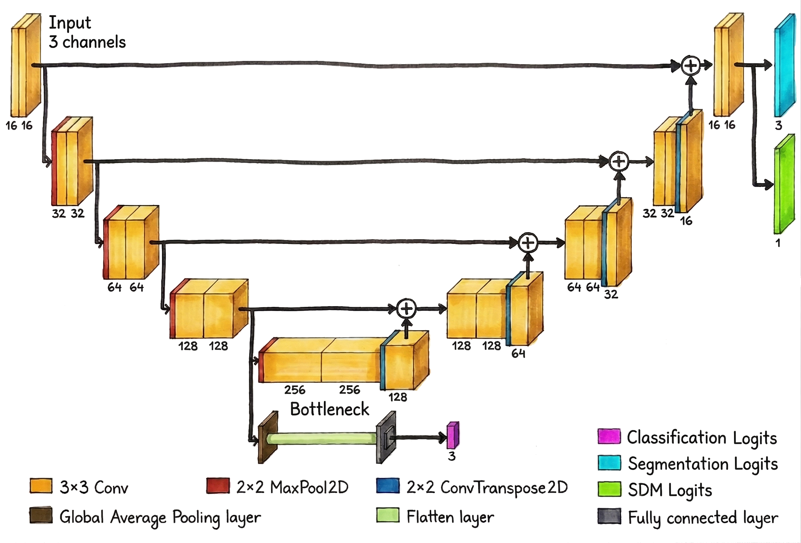

# Multi-output Boundary-Aware U-Net (MobaNet) for Semantic Segmentation

This repository provides an **end-to-end implementation** of a multi-output U-Net that supports both segmentation and classification, along with a set of distance-based loss functions for improved boundary prediction. All utilities needed to generate distance maps and train the model are included - no extra tooling required.

## :key: Key Features

1. **Multi-output architecture**  
   The network fuses segmentation and classification. When a large image is tiled, the classifier decides whether a tile is likely to contain an object boundary; only those positive tiles are forwarded to the segmentation branch. This approach:

   * Avoids unnecessary computation.
   * Enables boundary-aware losses during decoder training.
   * Produces uniform masks for single-class tiles.

2. **GPU-accelerated Signed Distance Transform (SDT) approximation**  
   Metrics such as Average Symmetric Surface Distance (ASD) and Hausdorff Distance 95th percentile (HD95) rely on Signed Distance Maps (SDMs) computed at every epoch. Traditional pipelines push tensors back to the CPU and call SciPy - which is slow and communication-heavy (especially on multi-GPU setups). Our PyTorch-only implementation uses cascaded convolutions, runs on batched data entirely on the GPU, and scales seamlessly with Distributed Data Parallel (DDP).

3. **A variety of loss function**  
   Pick from pixel-level, region-level, or boundary-aware losses or combine several. You can assign fixed or learnable weights to each component, letting you prioritise contour accuracy, global IoU, or any balance in between.

4. **Distributed training**  
   Native Distributed Data Parallel (DDP) support enables the use of multiple GPUs for both training and Signed Distane Map (SDM) calculations.

5. **Local & cloud logging**  
   Monitor progress with detailed console output, JSON logs, and optional Weights & Biases integration for remote experiment tracking.

## :rocket: Getting Started

1. Clone the repository:

    ```console
    (base) x@y:~$ git clone https://github.com/ZipZaap/AuxNet.git
    (base) x@y:~$ cd AuxNet
    ```

2. Create a virtual environment from `requirements.yml` & activate it

    ```console
    (base) x@y:~$ conda env create -f requirements.yml
    (base) x@y:~$ conda activate moba
    (moba) x@y:~$ 
    ```

3. Install the latest PyTorch version and make sure it is cuda-enabled. Choose the cuda version supported by your GPU.
   This step is done independently to make sure that PyTorch doesn't default to a CPU install.

    ```console
    (moba) x@y:~$ pip install torch torchvision --index-url https://download.pytorch.org/whl/cu128
    (moba) x@y:~$ python -c "import torch; print(torch.cuda.is_available())"
    True
    ```

## :open_file_folder: Repository structure

```graphql
configs/
│   ├─config.yaml ----------------- # Default parameters
│   ├─cfgparser.py ---------------- # Config() class which stores the defaults
│   ├─cli.py ---------------------- # Basic command-line interface
│   └─validator.py ---------------- # Validation logic
|
engines/
│   └─SegTrainer.py---------------- # Main training loop
|
model/
│   ├─MobaNet.py ------------------ # PyTorch model architechture 
│   ├─loss.py --------------------- # Loss functions for training
│   └─metrics.py ------------------ # Evaluation metrics
│
notebooks/
│   └─sdm_tests.ipynb.py ---------- # Distance transform speed & accuracy tests
│
saved/
│   └─exp_N/
│      ├─run-best.json ------------ # Best epoch metrics
|      ├─run-best.pth ------------- # Best model
│      └─run-log.json ------------- # Full run log
│
utils/
│   ├─dataset.py ------------------ # PyTorch DataLoaders + train/test split logic
│   ├─loggers.py ------------------ # Experiment tracking tools
│   ├─managers.py ----------------- # Model loading, device allocation & process management
│   ├─sdf.py ---------------------- # Signed Distance Map utilities
│   └─util.py --------------------- # Misc helper functions
|
train.py -------------------------- # Training entry point
predict.py ------------------------ # Inference entry point
requirements.yml ------------------ # Dependencies
README.md
```

> [!NOTE]
> Experiment tracking folders are auto-created in `saved/` during runtime

## :bar_chart: Dataset

This repository expects the training/testing data to be organized in the pre-defined manner described below. Update `DATASET_DIR` in [config.yaml](configs/config.yaml) to point to your dataset root:

* **For Training**:  `dataset/images` and `dataset/masks` must exist and contain valid `.png` files.
* **For Inference**:  only `predict/images` is required with valid `.png` files.

```graphql
dataset/
   ├─images/ ---------------------- # All image tiles in .png format
   ├─masks/ ----------------------- # All indexed masks in .png format
   ├─labels.json ------------------ # File containing class labels
   ├─train/
   |  ├─images/ ------------------- # Images selected for training
   |  ├─masks/ -------------------- # Corresponding masks
   |  ├─sdms/ --------------------- # Signed Distance Maps in .npy format 
   |  └─tts.json ------------------ # Train/test split dictionary of image IDs
   |
   └─predict/
      ├─images/ ------------------- # Images to run inference on
      └─masks/ -------------------- # Predicted masks
```

> All other assets (`train/`, `labels.json` & `predict/masks/`) are generated automatically at runtime.

### Example `labels.json`

Each *image_ID* is assigned a class based on the dominant label in its corresponding mask.

* If a single class occupies the majority of the mask, that class label is assigned to the image.
* If no single class dominates (e.g., the image contains significant class-to-class transitions), the boundary class is assigned instead.

```yaml
{
   'id_to_label': {
      0 : ['id_0', ..., 'id_a'],
      1 : ['id_1', ..., 'id_b'],
      2 : ['id_2', ..., 'id_c']
   },
   'label_to_id': {
      'id_0': 0,
      'id_1': 1,
      'id_2': 2,
      'id_a': 0,
      'id_b': 1,
      'id_c': 2
   }
}
```

> For an **N-class** segmentation task, there are **N + 1** possible labels in total, where the extra class (**N + 1**) is reserved for images/masks that contain class-to-class boundaries.

## :brain: Network architechture



The layout of the network is similar to that of a UNet with decoder otuput split into Segmentation and SDM logits and an aditional classification path branching off at the bottlneck layer. Since network graph in our code is constructed dynamically, the user is free to customize the number of horizontal layers in the UNet or the feature depth of the Conv2D blocks, as well as the number of input channels and output classes.

## :straight_ruler: Signed Distance Transform


> **Figure 2**: Comparison of Distance Transform speed and precision across different devices, methods and kernel sizes. Chebyshev Distance Transform (CDT) is build with PyTorch, while a default SciPy implementation is used to perform the Euclidean Distance Transform (EDT). All test a run with a sample size of a 1000 on an GeForce RTX4080 Super GPU. (**a**) Impact of varying kernel size and GPU number on CDT speed (GPU; batch = 16). (**b**) Mean Absolute Error (MAE) between normalized distance maps generated by SciPy and their respective PyTorch approximations. A linear decrease in error is observed for larger kernels. (**c**) Comparison of transform speeds between CPU, CPU batch=16, GPU, SciPy, GPU batch=16 and 4xGPU batch=16. (**d**) Visual comparison between true (SciPy) and approximated (PyTorch) distance maps.

This repository delivers a fully-differentiable, GPU-native approximation of Signed Distance Maps using cascaded convolutions, following the method of [Pham et al.](https://doi.org/10.1007/978-3-030-71278-5_31) (MICCAI 2021). We build on [Kornia’s](https://github.com/kornia/kornia/blob/main/kornia/contrib/distance_transform.py) `distance_transform` kernel, adding Sobel-based edge extraction and per-map normalization - all implemented in pure PyTorch. Once the training loop starts, every tensor is created on the target device and never leaves it, eliminating host-device transfer overhead. Even on a single consumer-grade GPU, our batched implementation consistently outpaces SciPy’s CPU-bound `edt_distance_transform`, with only negligible loss in numerical accuracy.

## :chart_with_downwards_trend: Loss functions

The library ships with a self-contained, GPU-friendly collection of segmentation and classification losses, all exposed through a unified `Loss` wrapper. Core segmentation options include pixel-wise criteria (standard and weighted **BCE**), region-level losses (probabilstic and discrete **DICE**, **IoU**), as well as boundary aware losses (standard and clamped **MAE**). We also provide a custom **Sign** term that penalises distance-map sign errors, and helps overcome some of the limitations of the standard **MAE**. Any subset can be fused together with `CombinedLoss`, which supports fixed or learnable weights, enabling the network to balance multiple objectives during training.

## :hammer_and_wrench: Basic Usage

### Run options

All configurable options, sensible defaults, and variable types are defined in the [config.yaml](configs/config.yaml) file. This file serves as the primary interface for users to customize and tailor the network to their specific needs. Before training begins, the configuration is loaded and validated by the `Validator` method. This method performs pre-defined checks to ensure consistency and prevent conflicts between parameters. This helps catch potential issues early, reducing the likelihood of unexpected behaviors during execution.

<details>
   <summary> Parameter breakdown </summary>

   | | Option | Type | Description |
   |---|---|---|---|
   | **Directories** |-----------------------|-------|--------------------------------------------------------------|
   || `DATASET_DIR` | `str` | Path to the dataset folder |
   || `RESULTS_DIR` | `str` | Path to the output folder |
   | **Dataset** |-----------------------|-------|--------------------------------------------------------------|
   || `SEED` | `int` | Random seed for dataset split |
   || `TRAIN_SET` | `str` | Training-set composition: <br>• `full`: unfiltered dataset  <br>• `boundary`: only images containing boundaries |
   || `TEST_SET` | `str` | Test-set composition: <br>• `full`: unfiltered dataset  <br>• `boundary`: only images containing boundaries |
   || `TEST_SPLIT` | `float` | Fraction reserved for testing |
   || `CROSS_VALIDATION` | `bool` | Enable K-fold cross-validation |
   || `DEFAULT_FOLD` | `int` | Fold to use when CV is disabled |
   || `NUM_WORKERS` | `int` | Number of subprocesses used by PyTorch `DataLoader`. If set to 0, data loading occurs in the main process |
   | **Model** |-----------------------|-------|--------------------------------------------------------------|
   || `MODEL` | `str` | The user can either train the entire model end-to-end in a single run, or train each component separately, using dedicated datasets and loss functions for each part: <br>• `MobaNet-ED`: multi-output UNet with trainable Encoder & Decoder <br> • `MobaNet-EDC`: multi-output UNet with trainable Encoder, Decoder & Classification head <br>• `MobaNet-C`: multi-output UNet with trainable Classification head <br>• `MobaNet-D`: multi-output UNet with trainable Decoder <br>• `UNet`: standard U-Net architecture.  |
   || `CHECKPOINT` | `str` | Path to the checkpoint file containing pre-trained weights <br>• When in `training` mode -  training will start from this checkpoint, unless `CHECKPOINT` is set to `null` <br>• When in `inference` mode - predictions will be made using this checkpoint; has to be set to a valid path |
   || `INPUT_SIZE` | `int` | Input image side length (pixels) |
   || `INPUT_CHANNELS` | `int` | Number of image channels |
   || `UNET_DEPTH` | `int` | Number of down-sampling levels in a UNet (incl. bottleneck) |
   || `CONV_DEPTH` | `int` | Base feature-map depth of the Conv2D block (doubles per level) |
   || `BATCH_SIZE` | `int` | Training batch size |
   | **Loss** |-----------------------|-------|--------------------------------------------------------------|
   || `LOSS` | `str` | Loss function used to train the model. Can either be a single loss or a combination of multiple losses, separated by `_` (e.g., `softDICE_BCE`): <br>• `SoftDICE`: Soft (probabilistic) DICE <br>• `HardDICE`: Hard (discrete) DICE <br>• `IoU`: Intersection over Union <br>• `SegCE`: Segmentation Cross-Entropy <br>• `wSegCE`: SDM-weighted Segmentation Cross-Entropy <br>• `ClsCE`: Classification Cross-Entropy <br>• `MAE`: Mean Absolute Error <br>• `cMAE`: Clamped Mean Absolute Error <br>• `sMAE`: Signed Mean Absolute Error|
   || `CLAMP_DELTA` | `float` | Delta for `cMAE` kernel clamping. Smaller values concentrate the network’s capacity on details near the boundary |
   || `STATIC_WEIGHTS` | `list` | Manual loss weights (if `ADAPTIVE_WEIGHTS = False`) |
   | **Segmentation** |-----------------------|-------|--------------------------------------------------------------|
   || `SEG_CLASSES` | `int` | Number of segmentation classes |
   || `SEG_DROPOUT` | `float` | Dropout for encoder/decoder |
   | **Classification** |-----------------------|-------|--------------------------------------------------------------|
   || `CLS_CLASSES` | `int` | Number of classification classes |
   || `CLS_DROPOUT` | `float` | Dropout in classification head |
   || `CLS_THRESHOLD` | `float` | Positive-class probability threshold |
   | **Optimizer** |-----------------------|-------|--------------------------------------------------------------|
   || `INIT_LR` | `float` | Initial learning rate at the beginning of warmup |
   || `BASE_LR` | `float` | Base learning rate reached by the end of warmup |
   || `L2_DECAY` | `float` | L2 regularization decay |
   || `WARMUP_EPOCHS` | `int` | Number of warmup epochs (0 = no warmup) |
   || `TRAIN_EPOCHS` | `int` | Number of training epochs (excl. warmup) |
   | **SDM** |-----------------------|-------|--------------------------------------------------------------|
   || `SDM_KERNEL_SIZE` | `int` | Kernel size for SDM estimation |
   || `SDM_DISTANCE` | `str` | Type of distance used for the SDM. Available options: `manhattan`, `chebyshev`, `euclidean` |
   || `SDM_NORMALIZATION` | `str` | SDM normalisation mode:: <br>• `minmax`: by both max and min distance values of each individual SDM. <br>• `dynamic_max`: by the max distance value of each individual SDM. <br>• `static_max`: by the global max distance value (depends on `SDM_DISTANCE`)|
   | **Evaluation** |-----------------------|-------|--------------------------------------------------------------|
   || `CHECKPOINT_INTERVAL` | `int` | Freqeuncy of saving model checkpoints |
   || `EVAL_METRIC` | `str` | Best epoch selection metric: <br>• `TTR`: True-to-test ratio. Measures classification accuracy <br>• `DSC`: DICE score. Measures global overlap <br>• `IoU`: Intersection over Union score. Measures global overlap, but penalizes false positives more harshly <br>• `ASD`: Average Symmetric Distance. Measures the mean distance between the boundaries of ground-truth and predicted segmentations <br>• `AD`: Average one-way Distance. Relaxes the impact of false-positives <br>• `HD95`: Hausdorff Distance 95th percentile. Measures the worst-case boundary discrepancy <br>• `D95`: One-way Distance 95th percentile. Relaxes the impact of false-positives  <br>• `CMA`: Combined Mean Accuracy. A weighted combination of the above |
   || `CMA_COEFFICIENTS` | `dict` | Coefficients that define the contribution of each metric to the overall `CMA` |
   || `SDM_FROM_MASK` | `bool` | Whether to derive the SDMs from the segmentation mask, or directly from the SDM logits |
   | **DDP** |-----------------------|-------|--------------------------------------------------------------|
   || `GPUs` | `list` | GPU indices for DDP |
   || `MASTER_ADDR` | `str` | Address of the master node |
   || `MASTER_PORT` | `str` | Port for DDP communication |
   || `NCCL_P2P` | `bool` | Enable peer-to-peer communication for DDP; Disabling this might help if you encounter issues with DDP |
   | **Logging** |-----------------------|-------|--------------------------------------------------------------|
   || `LOG_WANDB` | `bool` | Enable Weights & Biases logging |
   || `LOG_LOCAL` | `bool` | Save logs locally |
   || `EXP_ID` | `str` | Custom experiment identifier |
   || `RUN_ID` | `str` | Custom run identifier |

</details>

### Training & evaluation

1. **Training** is initialized from the CMD and is complemneted by detailed logs

   ```console
   (moba) foo@bar:~$ python train.py
   [INFO] Type `train.py --help` for more information
   [INFO] Configuration file passed all validation tests.
   [PREP] Generating class labels: 100%|███████████████████| 4933/4933 [00:06<00:00, 772.54it/s]
   [PREP] Generating SDMs on cuda:0: 100%|██████████████████████| 59/59 [00:07<00:00,  7.63it/s]
   [INFO] Running in non-distributed mode on cuda:0 ...
   [WARM] Warming up for 10 epochs ...
   [TRAIN] Training for 200 epochs ...
   Epoch 1/200 > ETC: 46.0m (14.0s / epoch)
            Loss   | ↑ TTR  | ↑ DSC  | ↑ IoU  | ↓ ASD  | ↓ HD95 | ↑ CMA  |
   Train -> 0.4786 | 0.9898 | 0.7887 | 0.6561 | 0.1391 | 0.2426 | 0.7611 |
   Test  -> 0.1691 | 1.0000 | 0.8557 | 0.7520 | 0.1107 | 0.2027 | 0.8169 |
   ----------------------------------------------------------------------+
   Epoch 2/200 > ETC: 45.0m (14.0s / epoch)
            Loss   | ↑ TTR  | ↑ DSC  | ↑ IoU  | ↓ ASD  | ↓ HD95 | ↑ CMA  |
   Train -> 0.2148 | 0.9885 | 0.8056 | 0.6786 | 0.1399 | 0.2379 | 0.7741 |
   Test  -> 0.1523 | 1.0000 | 0.8691 | 0.7734 | 0.1041 | 0.2017 | 0.8370 |
   ----------------------------------------------------------------------+
   ```

   Alternatively the user can launch training programmatically:

   ```python
   from train import train
   train("configs/config.yaml", dataset_dir="path/to/dataset", 
         batch_size=16, train_epochs=100, loss="SoftDICE", GPUs=[0, 1])
   ```

2. **Inference**

   ```console
   (moba) foo@bar:~$ python predict.py
   [INFO] Type `predict.py --help` for more information
   [INFO] Configuration file passed all validation tests.
   [INFO] Predictions saved to dataset_root/predict/masks/
   ```

   Or using the provided python API:

   ```python
   from predict import Predictor
   model = Predictor('saved/exp_0/MobaNet-model.pth', 'cuda:0', 0.8)
   imID = 'ESP_123456_1234_RED-1234_1234'
   impath = f'dataset_root/predict/images/{imID}.png'
   output = model.predict(impath)
   ```

## :artificial_satellite: Example use-case

## :memo: License

Distributed under the Apache 2.0 License. See [`LICENSE`](LICENSE.txt) for more information.

## :envelope: Contact

Martynchuk Oleksii - martyn.chuckie@gmail.com

## :handshake: Acknowledgements

This project was made possible thanks to the support and resources provided by:

* [Technische Universität Berlin (TU Berlin)](https://www.tu.berlin/)
* [German Aerospace Center (DLR) Berlin](https://www.dlr.de/de/das-dlr/standorte-und-bueros/berlin)
* [HiRISE (High Resolution Imaging Science Experiment) team at the University of Arizona](https://www.uahirise.org/)
* [HEIBRIDS School for Data Science](https://www.heibrids.berlin/)

Additional thanks to the open‑source community and all contributors who help improve this project.